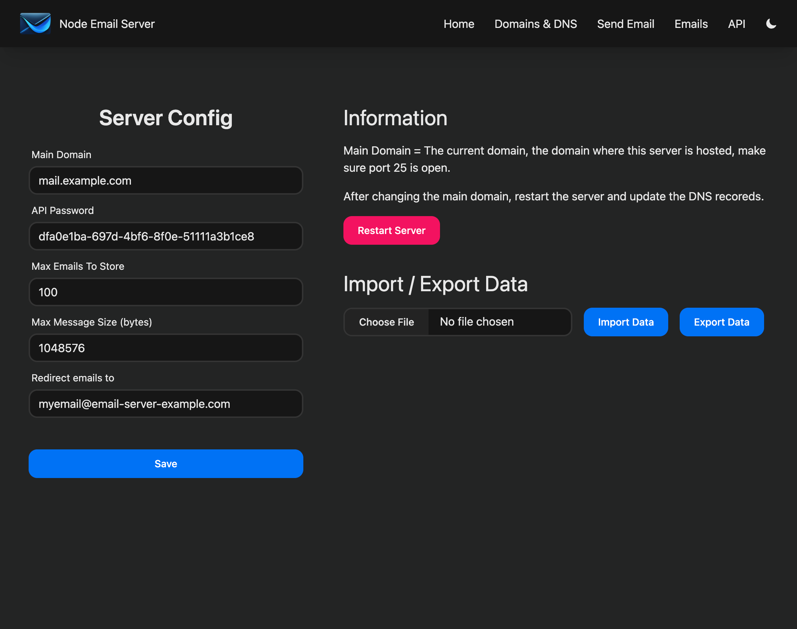
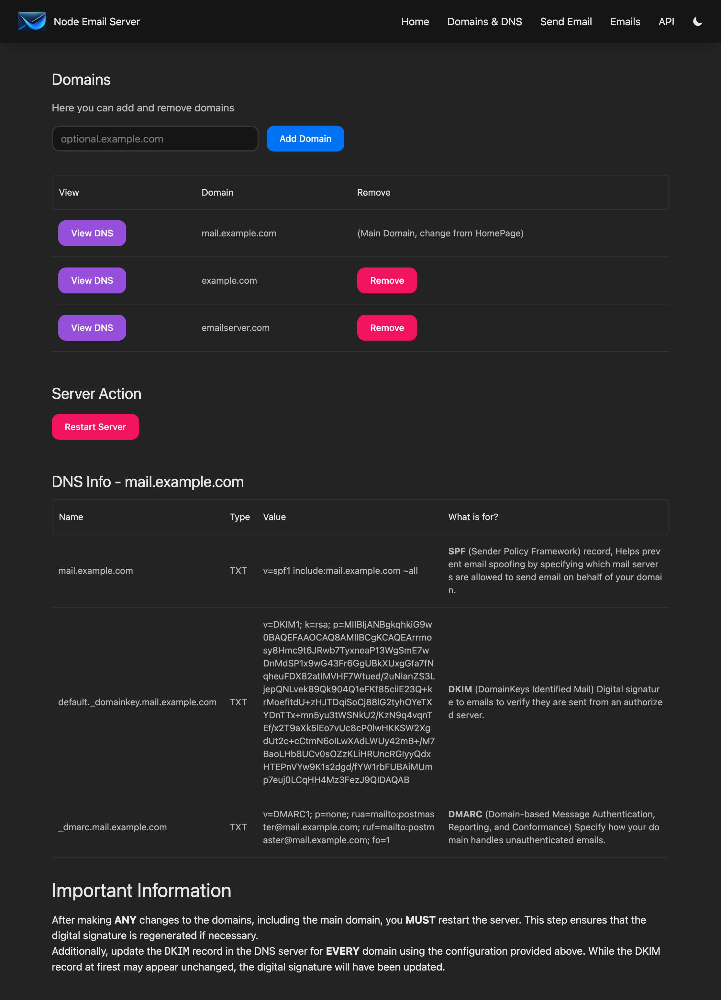
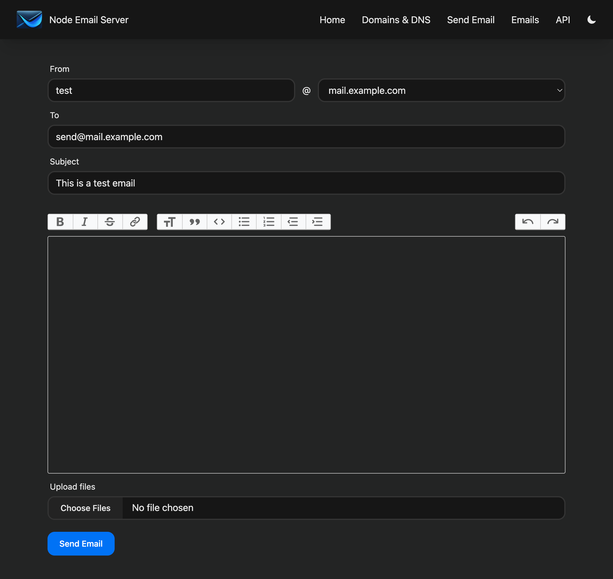
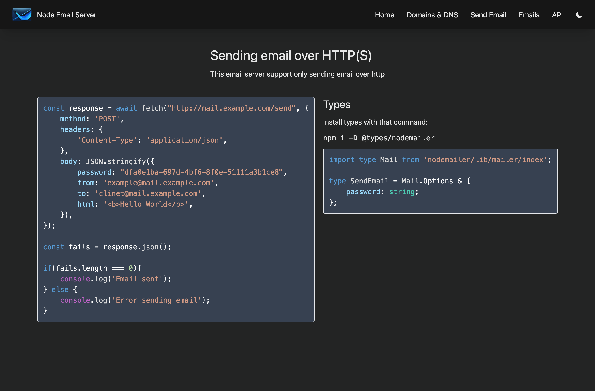
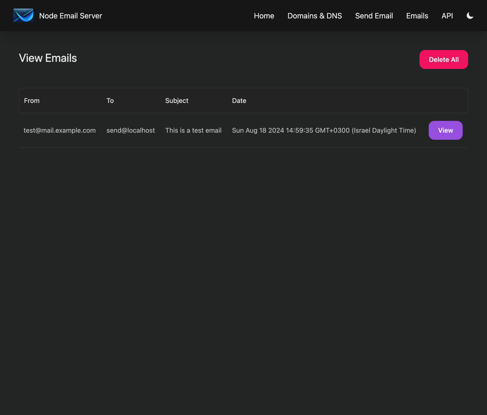

# Node Email Server

<div align="center">
    
</div>
<br />

> Light weight email server for Node.js over HTTP(S) with REST API

Built as a solution for sending emails without any third party services or complex configurations.

### Features
- Send email over HTTP(S) with REST API
- Light weight
- Support multiple domains
- Easy to use, no extra services required
- [CapRover](https://github.com/caprover/caprover)
support


### Deploy using Docker
```bash
docker build -t node-email-server .
docker run -p 25:25 -p 80:4321 -v /path/to/store/db:/app/storage -e PASSWORD=myDashboardPassword node-email-server
```

### REST API
```js
const response = await fetch("https://email.my-domain.com/send", {
    method: 'POST',
    headers: {
        'Content-Type': 'application/json',
    },
    body: JSON.stringify({
        password: "myPassword",
        from: 'example@email.my-domain.com',
        to: 'send@example.com',
        html: '<b>Hello World</b>',
    }),
});

const fails = response.json();

if(fails.length === 0){
    console.log('Email sent');
} else {
    console.log('Error sending email');
}
```

### About the project
 - Built using Node.js, Astro, and lowdb
 - SMTP server using `smtp-server` package
 - Server components using `@astro-utils/forms` package
 - UI components using `rippleui` package

## Screenshots

<div align="center">
    
    
    
    
    
</div>

## Please Star the project if you like it
<div align="center">
    
</div>